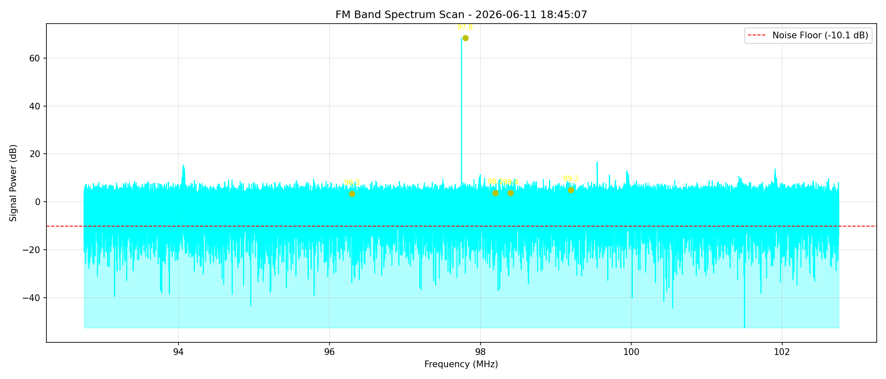

# Project 1 — FM Signal Strength Logger

A Python tool that captures the FM radio band (87.5–108 MHz) using a HackRF One/PortaPack H4M, computes a frequency spectrum via FFT, identifies the strongest stations, and logs the results to CSV.

## How It Works

1. Opens the HackRF and tunes to the center of the FM band
2. Captures 65,536 IQ samples in one shot at a 10 MHz sample rate
3. Computes an FFT to convert the raw samples into a frequency spectrum
4. Filters the spectrum down to the FM band (87.5–108 MHz)
5. Identifies the top 5 strongest stations (deduplicated)
6. Saves all data points to a timestamped CSV file
7. Plots the spectrum with a noise floor reference line and top station markers

## Example Output



Top 5 strongest stations:

97.8 MHz  -->  68.29 dB

99.2 MHz  -->  4.99 dB

98.2 MHz  -->  3.72 dB

98.4 MHz  -->  3.66 dB

96.3 MHz  -->  3.41 dB

## Requirements

- HackRF One / PortaPack H4M (Mayhem firmware)
- Python 3 with SoapySDR, NumPy, Matplotlib
- Linux (tested on Ubuntu 20.04)

## Usage

```bash
python3 fm_logger.py
```

## Key Concepts Demonstrated

- IQ sample acquisition via SoapySDR
- FFT-based spectrum analysis
- Signal power calculation and dB conversion
- Noise floor estimation
- Error handling and hardware failsafes
- Data logging with CSV
