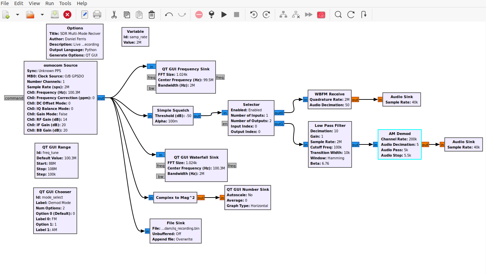
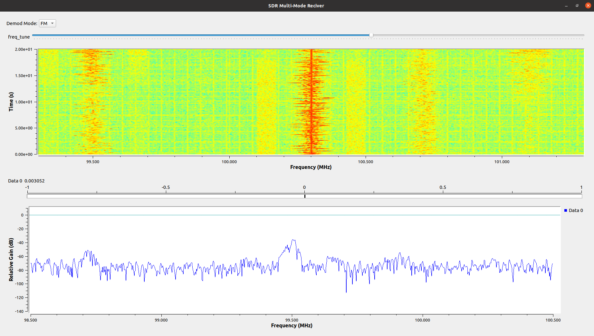

# GNU Radio SDR Multi-Mode Receiver

A live, interactive software-defined radio receiver built in GNU Radio Companion using the HackRF One/PortaPack H4M. Supports real-time FM and AM demodulation, live spectrum and waterfall displays, signal strength monitoring, automatic squelch, and raw IQ recording.

## Flowgraph Architecture



## Features

- **Live Spectrum Display** — real-time FFT spectrum of the received signal
- **Waterfall Display** — scrolling time-history spectrum showing signal activity over time
- **FM Demodulation** — live FM broadcast audio through speakers
- **AM Demodulation** — AM demodulation path for aviation and other AM signals
- **FM/AM Mode Toggle** — switch between demodulation modes on the fly
- **Interactive Frequency Tuning** — slider control covering 88–137 MHz
- **Signal Strength Meter** — live numeric power reading updating in real time
- **Automatic Squelch** — mutes audio when signal drops below threshold
- **IQ Recording** — saves raw complex IQ samples to disk for offline analysis

## Live Demo Screenshot



## Signal Processing Chain

osmocom Source (HackRF)

├── QT GUI Frequency Sink (spectrum display)

├── QT GUI Waterfall Sink (waterfall display)

├── Complex to Mag^2 → QT GUI Number Sink (signal meter)

├── File Sink (IQ recording)

└── Simple Squelch → Selector

├── out0 → WBFM Receive → Audio Sink (FM audio)

└── out1 → Low Pass Filter → AM Demod → Audio Sink (AM audio)

## Hardware

- HackRF One / PortaPack H4M (Mayhem firmware v2.4.0)
- Stock telescopic antenna
- Ubuntu 20.04 (Dell Precision 7770)

## Requirements

- GNU Radio 3.8+
- gr-osmosdr
- Python 3

## Usage

```bash
gnuradio-companion sdr_receiver.grc
```

Then click the green play button to run.

## Notes

- AM demodulation tested on aviation frequencies (118–137 MHz) near Dulles Airport
- Signal activity visible in waterfall but clear audio decode requires a better antenna tuned for VHF aviation band
- IQ samples saved to `/home/adam/iq_recording.bin` during operation