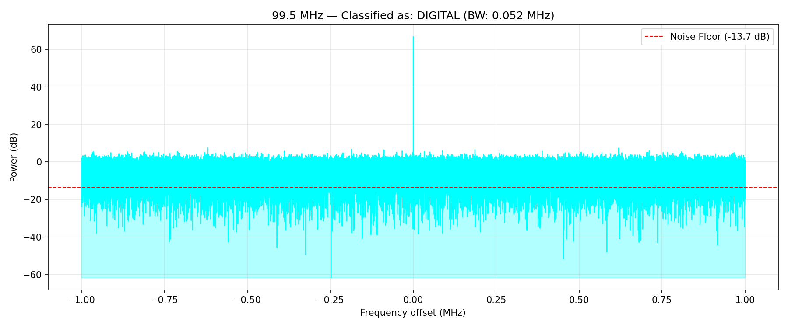

# Project 2 — Automatic Signal Classifier

A Python tool that captures IQ samples from a HackRF One/PortaPack H4M, computes an FFT spectrum, and classifies the signal as FM, AM, Digital, or Noise based on bandwidth and signal shape.

## How It Works

1. Opens the HackRF and tunes to a target frequency
2. Captures IQ samples and computes an FFT spectrum
3. Removes the DC spike artifact present in HackRF hardware
4. Measures signal-to-noise ratio (SNR) and bandwidth at -6 dB from peak
5. Classifies the signal based on bandwidth:
   - **FM**: > 0.08 MHz (matches real FM broadcast bandwidth)
   - **Digital**: 0.01–0.08 MHz
   - **AM**: < 0.01 MHz
   - **Noise**: SNR below threshold
6. Logs every result to CSV with timestamp
7. Saves a labeled spectrum plot for each classification

## Validation

The classifier was validated two ways:

**Live hardware testing** — correctly classified real FM radio stations (99.5 MHz, 97.8 MHz) as FM with consistent bandwidth measurements around 0.12–0.18 MHz.

**Synthetic signal testing** — generated synthetic FM, AM, Digital, and Noise IQ samples mathematically to test the classifier against known signal types.

### Known Limitation

Real hardware signals and synthetic signals require different processing pipelines. The DC spike removal step (designed to filter out a known HackRF hardware artifact) overlaps with the energy of synthetic signals, since synthetic test signals are generated centered at 0 Hz while real signals are naturally offset from the DC spike. This is a documented hardware/software interaction and a good target for future improvement — generating synthetic signals with a frequency offset would resolve it.

## Example Output



Analyzing 99.5 MHz...

Result:      FM

Bandwidth:   0.148 MHz

Noise Floor: -10.47 dB

## Requirements

- HackRF One / PortaPack H4M (Mayhem firmware)
- Python 3 with SoapySDR, NumPy, Matplotlib
- Linux (tested on Ubuntu 20.04)

## Usage

```bash
python3 signal_classifier.py
```

## Key Concepts Demonstrated

- FFT-based spectrum analysis
- Signal bandwidth measurement
- DC offset / hardware artifact handling
- Synthetic signal generation for algorithm validation
- Error handling and hardware failsafes
- Data logging with CSV